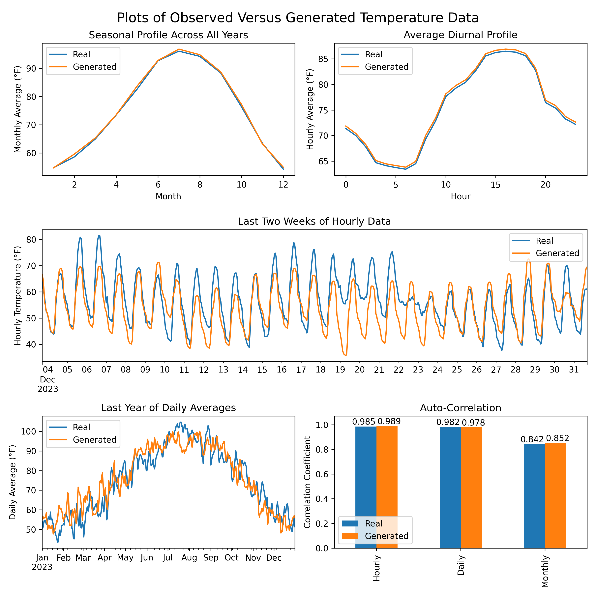

# VAE for Time Series

This repository contains code to generate time series using a Variational Autoencoder (VAE).

## Contents

- download_data.ipyb: Downloads ERA5 temperature data from CDS and saves it as a .nc file.
- process_data.ipynb: Reformats and standardizes the data for use in the VAE.
- vae.ipynb: Trains the VAE and generates time series.
- plots.ipynb: Plot comparison of generated time series to real data.

## Results

Sampling from the latent space of the model, I generated unique, compelling time series data that matches the 
characteristics of the original data--especially seasonal patterns, daily patterns, and autocorrelation.

Image of generated time series:

